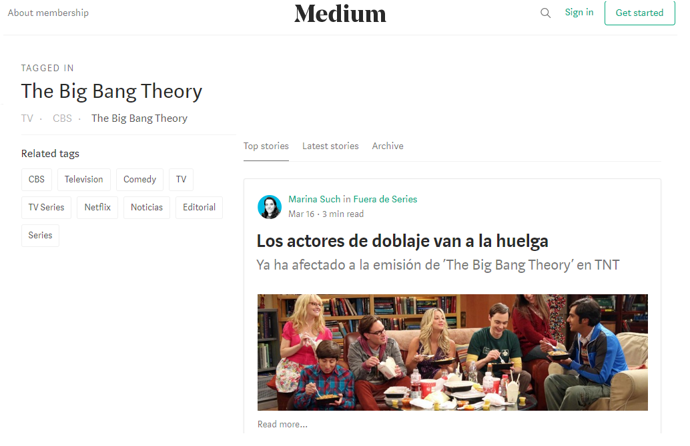
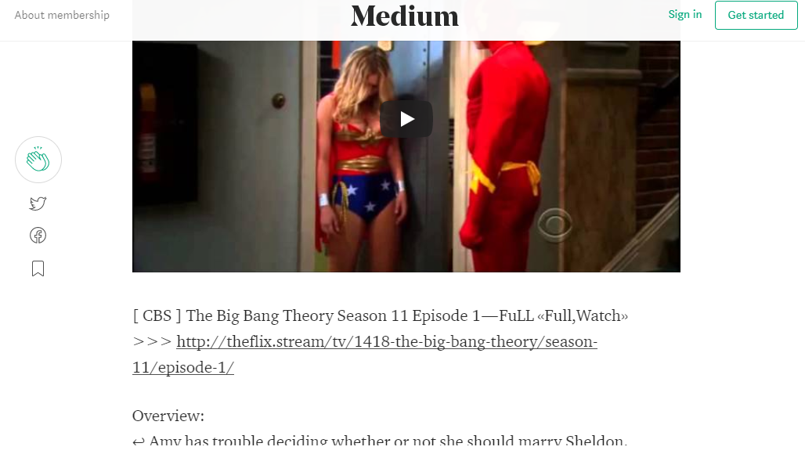
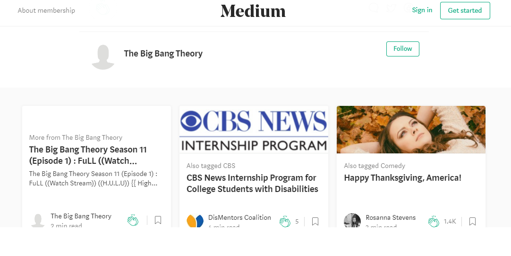

Identifica los elementos de navegación en los siguientes sites:

°Medium

Es una plataforma de publicación de contenidos, destinada a favorecer sobre todo al texto, totalmente minimalista que ayuda al lector a centrarse en el contenido, esta experiencia de uso lleva a alcanzar el trance necesario que busca todo lector interesado en un texto concreto.

A continuacion veremos los tipos de navegacion que presenta Medium:

Navegacion local: podemos apreciar que dentro de la pagina web hay un buscador.

Navegacion facetada: cuando introducimos texto en el buscador, se muestra a continuacion una serie de filtros no editables

Navegacion inline: dentro de la pagina de acuerdo a nuestra busqueda encontraremos links de apoyo. 

Navegacion Contextual:  ya que aparecen articulos relacionados de acuerdo a nuestra busqueda.

